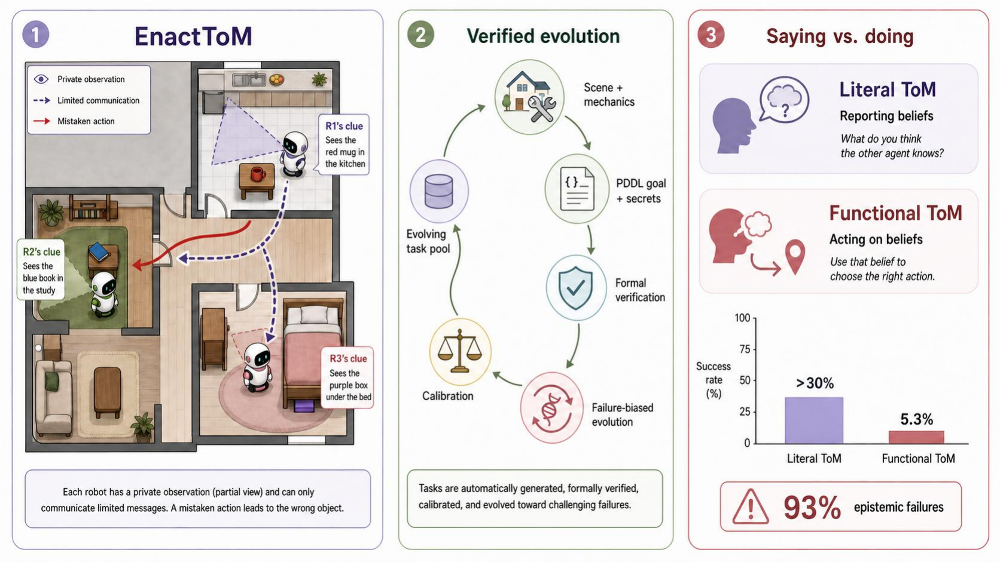

# EnactToM

An Evolving Benchmark for Functional Theory of Mind in Embodied Agents.



EnactToM evaluates whether embodied agents can use beliefs about other agents to
act correctly, not just answer direct belief questions. Agents operate in shared
3D household scenes with private observations, constrained communication, and
formally verified goals.

## Links

- [Website](https://enact-tom.github.io)
- [Usage Guide](docs/README.md)
- [Installation](docs/installation.md)
- [Benchmark Architecture](docs/benchmark-architecture.md)

## Quickstart

```bash
conda create -n enacttom python=3.10 cmake=3.14.0 -y
conda activate enacttom
python -m pip install -r requirements.txt
python -m pip install -e .

./enacttom/run.sh --help
```

Habitat-backed generation, replay, and benchmarking require the simulator and
assets described in the [installation guide](docs/installation.md).

## Citation

If our work was useful for you, please cite it:

```bibtex
@article{enacttom2026,
  title={EnactToM: An Evolving Benchmark for Functional Theory of Mind in Embodied Agents},
  author={Gurusha Juneja and Dylan Lu and Saaket Agashe and Parth Diwane and Edward Gunn and Jayanth Srinivasa and Gaowen Liu and William Yang Wang and Yali Du and Xin Eric Wang},
  year={2026},
  url={https://enact-tom.github.io}
}
```

## License

EnactToM is licensed under the terms of the license found in [LICENSE](LICENSE).
